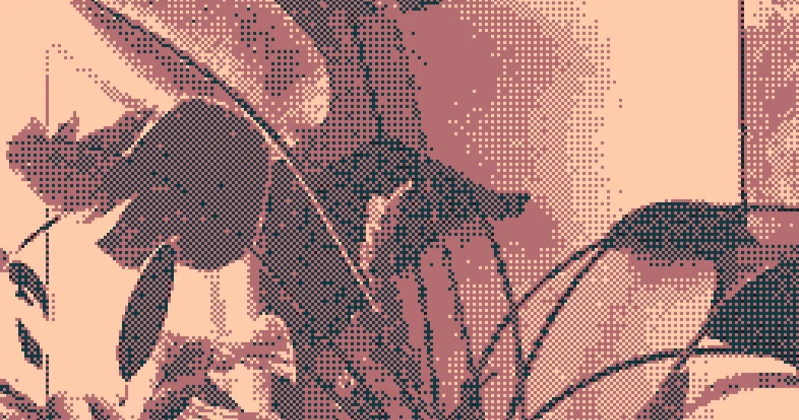

# Dithering



A set of tools to apply dithering algorithms with custom palettes and scalings

## Install

Requires Python 3.13+ and [uv](https://docs.astral.sh/uv/).

```sh
git clone https://github.com/dithernaut/dithering.git
cd dithering
uv tool install -e .
```

This installs `dither` and `dither-explorer` as global commands. The `-e` (editable) flag means changes to the source take effect immediately.

To uninstall:

```sh
uv tool uninstall dithering
```

## Usage

### `dither` — Apply a single algorithm

```sh
# Defaults: Floyd-Steinberg, 6-tone grayscale
dither photo.jpg

# Pick an algorithm and palette
dither photo.jpg --algorithm atkinson --palette gameboy

# Ordered dithering with custom order
dither photo.jpg --algorithm bayer --order 8

# Custom palette and tint
dither photo.jpg --palette '#000000,#808080,#ffffff' --tint "#e9633b"

# Resize before dithering, then scale up (nearest neighbor)
dither photo.jpg --width 200 --scale 4

# List available algorithms and palettes
dither --list-algorithms
dither --list-palettes
```

Output is saved next to the input file as `<name>_dithered.png`. Use `--output` to override.

### `dither-explorer` — Compare all algorithms at once

```sh
# Run all algorithms, output to dithered_output/
dither-explorer photo.jpg

# Custom output directory and width
dither-explorer photo.jpg --outdir results --width 800

# With a specific palette, tint, or scale
dither-explorer photo.jpg --palette ocean
dither-explorer photo.jpg --tint "#e9633b"
dither-explorer photo.jpg --width 200 --scale 4
```

Outputs individual images plus a comparison grid.

## Available algorithms

**Ordered:** bayer, cluster-dot, yliluoma

**Error diffusion:** floyd-steinberg, atkinson, jarvis-judice-ninke, stucki, burkes, sierra3, sierra2, sierra-2-4a

## Available palettes

bw, 3tone, 4tone, 6tone, 8tone, cga, gameboy, sepia, nord, warmth, ocean, pico, dithernaut

You can also pass custom hex colors: `--palette '#ff0000,#00ff00,#0000ff'`

Palettes are defined in `palettes.py` — add new ones there and both commands pick them up.
